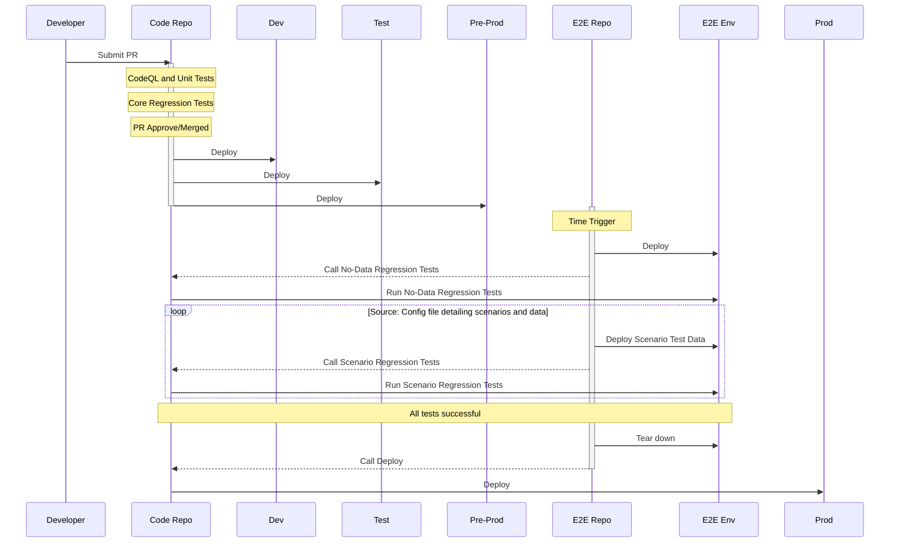

# Introduction

# The Problem
I'm working on a project that has some interesting test and release requirements. All our PBIs are defined using [BDD]() and our acceptance criteria are written as [Gherkin statements](). To support this, we're using [Specflow]() to generate our tests, and as most of these behaviours reflect user scenarios, we're using [Playwright]() to automate browser interaction to run these tests.

We've got some pretty standard Git operations set up - when you open a pull request, we run any unit tests in the repository, and we also run a [CodeQL]() analysis. If all these pass (and there are no merge conflicts), the code can be merged once it's approved by a reviewer. When the code is merged, we run workflows that deploy to dev and test environments (but not production).

We're not using a microservices architecture, but we do have a number of independent components that make up the solution, including:

 - A UI built in Blazor
 - A REST API built in .NET 5
 - Dynamics CRM
 - [Contentful]() headless CMS
 - [InRule]() business rules engine

All of these components have repositories on GitHub (either for the code or for the configuration), so the above mentioned standard Git operations apply to each of these independently. The tests and deployments operate in isolation.

While the components are independent, all of them are required to provide the full solution. Some of them have interdependencies, but ultimately everything is required to provide the expected behaviours in the UI. So the challenge was finding a way to deploy all the components to a fully integrated end-to-end test environment, with controlled test scenario data, to run our Specflow BDD tests in Playwright.

# The Solution

## First Attempt

I started by defining the requirements and I came up with this sequence diagram (disclaimer: I'm less than amateur when it comes to these so please try not to judge me too harshly for this!).



The idea here is that the code repositories still maintain their own test and deploy workflows, and an 'E2E repo' orchestrates all these workflows by calling them using workflow dispatch. There are a few problems with this approach though:

 - We need to ensure all the deployments are complete before running tests
 - We need a way of aggregating test results in the E2E Repo workflow
 - We need a way to protect the deploy to production workflows from being called unless a successful suite of tests has been run
 - Unneccessarily complicated workflow in the E2E Repo, requiring lots of custom defined scripting and actions

## Second Attempt
After toying with this for a while, I discovered a much simpler approach using just one workflow to test and deploy the code from all the other repositories.

To experiment with my approach I built a small proof GitHub organisation as a of concept. You can see it here: [e2e on GitHub link]()

The solution is as follows:

 - **Service One:** This simulates a micro service or other critical component of the solution. In this case, it retrieves as string from another API (Servicce Two) and appends it to a string of its own ("Hello, ") and returns the full concatenated string over a REST API.
 - **Service Two:** This simulates a micro service with no other dependencies. Returns a string ("world!") over a REST API.
 - **UI:** This is a simple UI built in Blazor that retrieves a string from an API (Service One) and displays it on screen.
 - **Tests:** This repository contains the Playwright tests that validate the behaviours we are expecting in the UI.
 - **Orchestrator:** This repository contains the workflow that deploys our full solution to our end to end test environment, runs the BDD tests from the Test repository and, if they pass, deploys the full solution to our production environment.

The significant change here from the original solution is that the Playwright tests have been moved into their own repository. The two service repositories still have their unit tests - the unit tests have the codebase they are testing as a dependency - but the Playwright tests have been moved to their own repo. Playwright tests, being just browser automation, shouldn't take any dependency on the code they are testing.

The main reason for moving the Playwright tests into their own repo is that the test fixtures can now be sued to deploy their required data, rather than depending on workflows to do this for them. This is much more in keeping with testing best practices in that tests are autonamous and don't depend on external resources.

# The Orchestrator
## Overview
Now that we have an Orchestrator repository that is responsible for deploying the test environment, running the tests, and then deploying the production environment, the workflow in here needs to do all of these steps itself (rather than calling workflows in other repositories to make this happen). In short the Orchestrator needs to do the following steps:

1. Build Service One
2. Build Service Two
3. Deploy Service One to E2E test environment
4. Deploy Service Two to E2E test environment
5. Build UI and deploy to E2E test environment
6. Run Playwright tests against E2E test environment
7. Deploy Service One to production environment
8. Deploy Service Two to production environment
9. Build UI and deploy to production environment

To make this work, the workflow needs to grab code from another repository. So whereas we might normally start our workflows like this:

```yaml
jobs:
  build_service_one:
    runs-on: ubuntu-latest
    name: Build Service One
    steps:
      - uses: actions/checkout@v2
```

Now we start it like this:

```yaml
jobs:
  build_service_one:
    runs-on: ubuntu-latest
    name: Build Service One
    steps:
      - uses: actions/checkout@v2
        with:
          repository: E2E-Orchestration/Service-One
          path: service-one
```

The key differnece here is that rather than checking out the code *from the repository in which we are running*, we are checking out code *from a different repository*. The syntax for doing this in a GitHub Actions workflow (using the `checkout@v2` action) is `[Organization]/[Repository]`. In my case, all the repositories are in the same Organization to avoid the need for PATs - the permissions are implicit.

The Orchestrator can now go on to complete the remaining steps.

## Steps in More Detail

These steps may not be interesting for some people - but for me, as someone who has never written YAML before and is only starting to get to grips with GitHub Actions - this could be useful. You can see the full workflow [here](), but I'll go through some of the interesting steps in detail.

First let's take a look at the triggers:

```yaml
on:
  workflow_dispatch:
  schedule:
    - cron: '0 0 * * *'
```

I added `workflow_dispatch` so I could trigger these manually for testing, but the important trigger here is the `cron` job. I won't go into `cron` syntax here, but in summary this means that the job runs on hour 0, minute 0 (so midnight - although this is midnight in UTC) of every day, week and month (the asterisks).

Now let's look at the jobs. The first job is to build Service One:

```yaml
  build_service_one:
    runs-on: ubuntu-latest
    name: Build Service One
    steps:
      - uses: actions/checkout@v2
        with:
          repository: E2E-Orchestration/Service-One
          path: service-one

      - name: Set up .NET Core
        uses: actions/setup-dotnet@v1
        with:
          dotnet-version: '5.0.x'
          include-prerelease: true

      - name: Build with dotnet
        working-directory: ./service-one
        run: dotnet build --configuration Release

      - name: dotnet publish
        working-directory: ./service-one
        run: dotnet publish -c Release src/Service-One.Web -o ${{env.DOTNET_ROOT}}/service-one

      - name: Upload artifact for deployment job
        uses: actions/upload-artifact@v2
        with:
          name: service-one-app
          path: ${{env.DOTNET_ROOT}}/service-one
```

First we specify a couple of details - the name of the job and that it runs on Ubuntu.

Next we checkout the code from out **Service One** repository, into a file path of `service-one`.

**NOTE:** Specifying the path is important, because all the jobs in this workflow will use the same working directory. So we need to specify a path for each repository that we are checking out into our working directory.

The next step is to setup our .NET version. Here we're telling it to use .NET5, any minor version.

After this we run a build with the .NET CLI. Note the use of the `working-directory: ./service-one` parameter. This tells the .NET CLI to run the `build` command against code in the serive-one directory - where we've just checked out the code from the Service One repo.

After this we run `publish` command from the .NET CLI - using the same directory parameter, as well as some additional config to tell the command where to find our source code and which profile to use.

Finally we upload our artifact ready for deployment, giving it a name of `service-one-app` that we can use in our deployment job.

```yaml
  deploy_service_one_e2e:
    runs-on: ubuntu-latest
    needs: build_service_one
    name: Deploy Service One
    environment:
      name: 'test'
      url: ${{ steps.deploy-to-webapp.outputs.webapp-url }}

    steps:
    - uses: actions/download-artifact@v2
      with:
        name: service-one-app

    - uses: azure/webapps-deploy@v2
      with:
        app-name: 'service-one-e2e'
        publish-profile: ${{ secrets.AZURE_CREDENTIALS_SERVICE_ONE }}
        package: .
    
    - uses: azure/login@v1
      with:
        creds: '${{ secrets.AZ_LOGIN_SERVICE_ONE }}'
    
    - uses: azure/appservice-settings@v1
      with:
        app-name: 'service-one-e2e'
        mask-inputs: false
        app-settings-json: |
          [
            {
              "name": "ServiceTwoUrl",
              "value": "https://service-two-e2e.azurewebsites.net/api/",
              "slotSetting": false
            }
          ]
    
    - run: |
        az logout
```